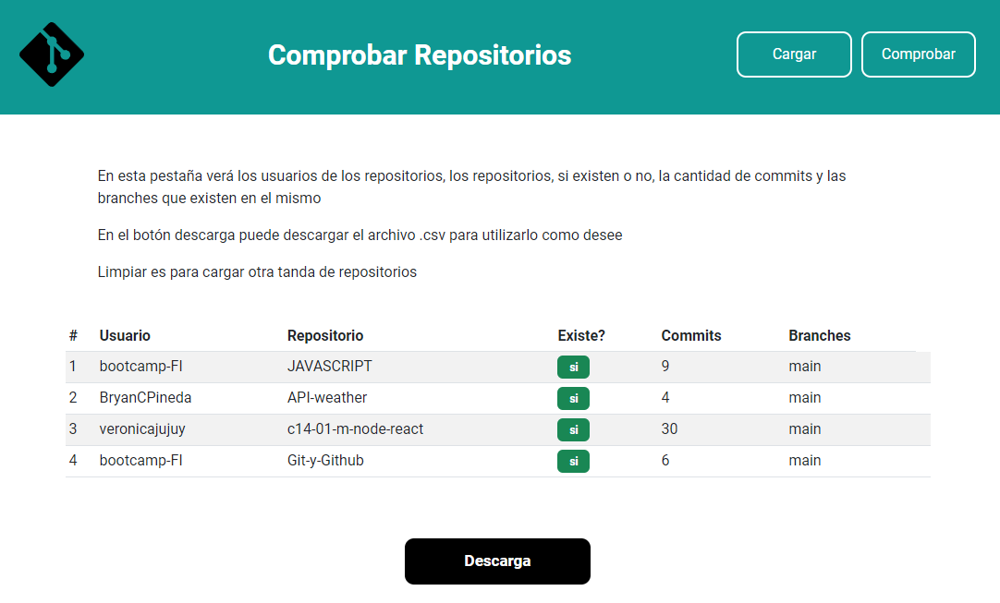

# Comprobando Repositorios de Alumnos

**Comprobando Repositorios de Alumnos** es una herramienta diseñada para verificar automáticamente el estado de los repositorios de GitHub de los estudiantes en un curso. La aplicación permite cargar un archivo CSV con las URLs de los repositorios de los alumnos y realiza varias comprobaciones sobre cada repositorio.



## Funcionalidades

- **Existencia del Repositorio**: Verifica si el repositorio especificado existe en GitHub.
- **Commits**: Consulta el número de commits realizados en el repositorio.
- **Branches**: Lista las ramas (`branches`) existentes en cada repositorio.
- **Archivos en las Ramas** (opcional): Puede consultar los archivos presentes en cada rama para un análisis más detallado.

## Tecnologías Utilizadas

- **Backend**: Node.js
- **Frontend**: React.js
- **API**: GitHub API
- **Gestión de Estado**: React Hooks
- **Estilo**: Bootstrap

## Instalación y Configuración

1. Clona estos repositorio:
   ```bash
   mkdir comprobando-repos
   cd comprobando-repos
   git clone https://github.com/veronicajujuy/check-correccion-front.git
   git clone https://github.com/veronicajujuy/check-intro-back.git
   
2. **Instala las dependencias tanto para el backend como para el frontend**:

   ```bash
   cd check-intro-back
   npm install

   cd ../check-correccion-front
   npm install
   
3. **Configura las variables de entorno. Crea un archivo .env en el directorio del backend con tu token de GitHub:**:
    ```bash
    GITHUB_TOKEN=tu_token_de_github
4. Inicia el servidor:
   ```bash
     cd backend
     npm start
4. Inicia el frontend:
   ```bash
     cd front
     npm run dev
6. **Accede a la aplicación en tu navegador:**
    ```bash
     http://localhost:5173
## Uso de la Aplicación

### Cargar Repositorios

- Selecciona un archivo CSV que contenga las URLs de los repositorios de los alumnos.
- Haz clic en "Cargar" para subir el archivo.

### Comprobar Repositorios

- Haz clic en "Comprobar" para iniciar la verificación de los repositorios.
- Los resultados mostrarán si el repositorio existe, el número de commits, las ramas y los archivos (si se configuró).

### Descargar Resultados

- Una vez completada la verificación, puedes descargar los resultados para archivarlos o compartirlos.

### Limpiar Datos

- Puedes limpiar los datos procesados para cargar un nuevo conjunto de repositorios.

## Contribuciones

Las contribuciones son bienvenidas. Si deseas contribuir, por favor sigue estos pasos:

1. Haz un fork del repositorio.
2. Crea una nueva rama para tu funcionalidad (`git checkout -b feature/nueva-funcionalidad`).
3. Realiza tus cambios y haz commit (`git commit -m 'Agrega nueva funcionalidad'`).
4. Sube tus cambios a GitHub (`git push origin feature/nueva-funcionalidad`).
5. Crea un Pull Request explicando los cambios realizados.
